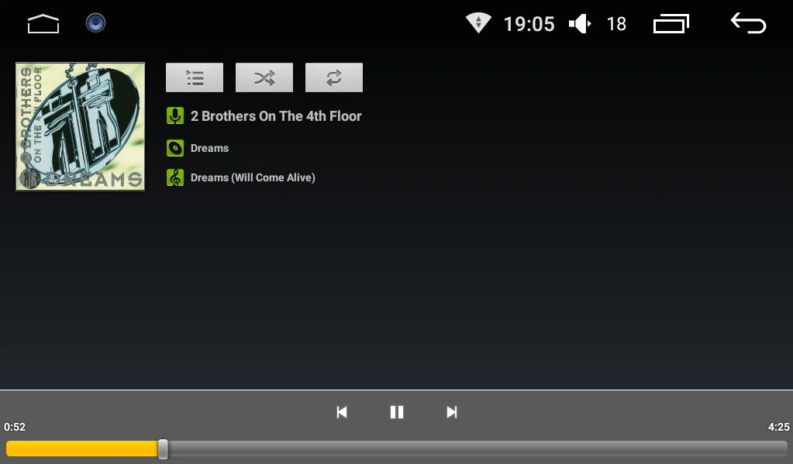
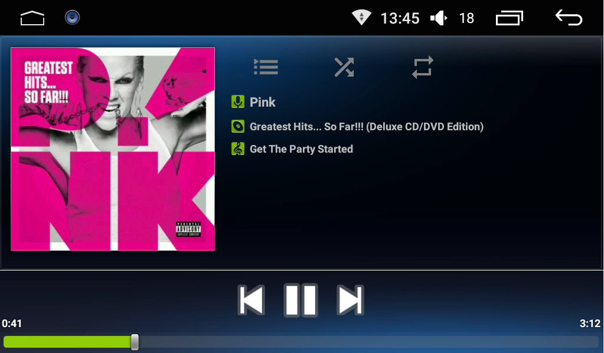
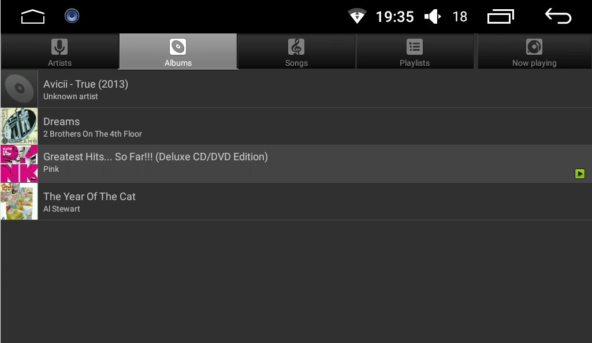
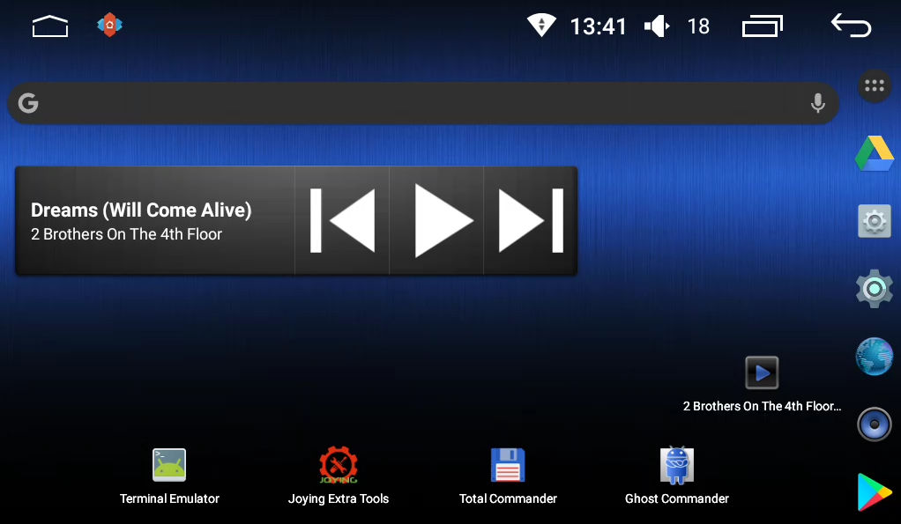

# aosp-music
Big Button Android aosp music player.

This is the default music player from the Android AOSP project
The source code from the Android Project can be found here:
http://android.googlesource.com/platform/packages/apps/Music.git

Even though the aosp music player is simpler than most other players, it has developed through the years and has full functionality for albums, playlists and album art.
This is a modification for a car head unit (running 1024x600 at around 160 dpi)

There are a couple of modifications:
* BIG BUTTONS. *(see below)* To make it easier to tap your screen while driving without having to be a "sharpshooter".
* Increased fonts and album art in the main player screen. *(see below)*
* The notification is clearer and has the album art visible on it.
* The lockscreen shows the default album art if there's no album art found for a song.
* Set minimal SDK to 23 (Android 6.0) and target to 26 (Android 8) for some optimization and uses of styles.

[Full Changelog](https://github.com/hvdwolf/aosp-music/blob/master/Changelog.md)

**Only for Joying FYT users**
This music player listens to the Joying Music player intents. This means that the Joying FYT music player can be removed as this music player will also react on the standard FYT commands and to the hardware MEDIA button.

**Original screen**
 

**Big button & big font screen with "materialized" icon buttons**
 

**Tabs overview**

**The very simple big button widget**
